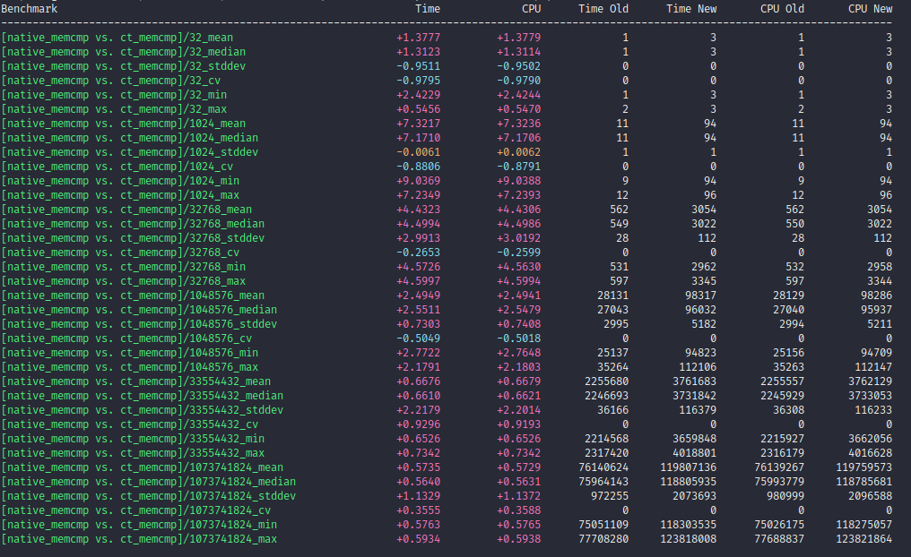
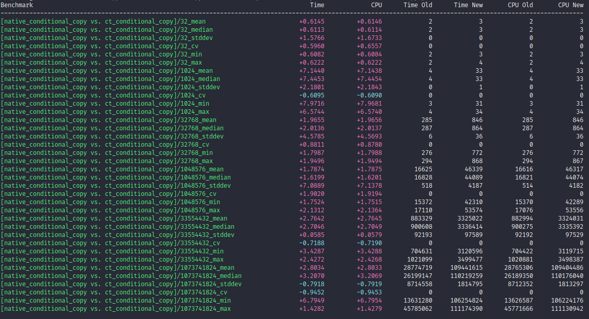
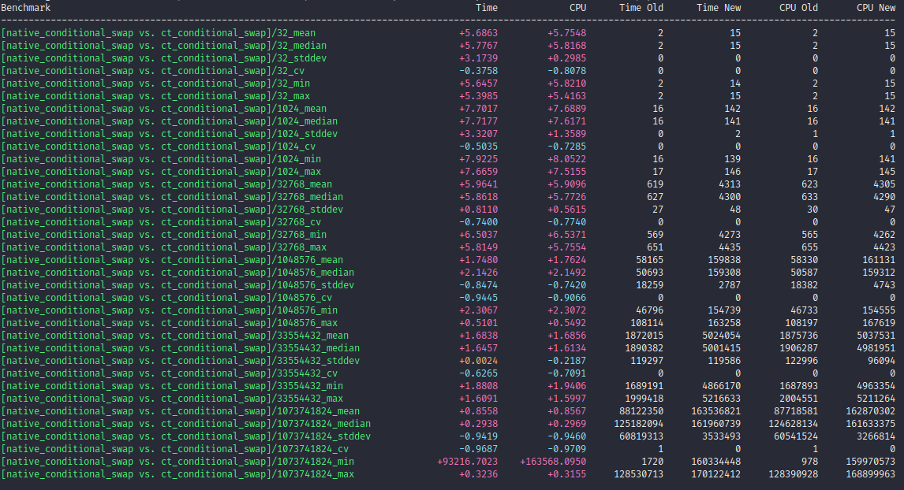

# subtle

Constant-time operations on both signed and unsigned integer values of 8, 16, 32, 64 bit widths — comparison, zero-testing, min/max, conditional selection/swap, memory compare, conditional copy/set, secure zeroization and secret-index table lookup. C++20, header-only, fully `constexpr` library.

> [!NOTE]
> `constexpr` ? Yes, all functions can be evaluated at compile-time — useful for `static_assert` based test cases.

## Quick Start

Add `subtle` to your CMake project via `FetchContent`:

```cmake
include(FetchContent)
FetchContent_Declare(
  subtle
  GIT_REPOSITORY https://github.com/itzmeanjan/subtle.git
  GIT_TAG master
  GIT_SHALLOW TRUE
)
FetchContent_MakeAvailable(subtle)

target_link_libraries(my_app PRIVATE subtle)
```

Compare two byte arrays in constant-time:

```cpp
#include "subtle.hpp"
#include <algorithm>
#include <array>
#include <cstdint>
#include <span>

std::array<uint8_t, 16> a;
std::array<uint8_t, 16> b;

std::ranges::fill(a, 0xae);
std::ranges::fill(b, 0xde);

const uint32_t equal = subtle::ct_memcmp<uint8_t, uint32_t>(std::span(a), std::span(b));
```

`std::memcmp` would short-circuit its execution as early as possible. It is data-dependent. When comparing secret key material, we want comparison to always take same time. The secret material value must not affect timing of comparison. `subtle::ct_memcmp` guarantees this by AND-accumulating a per-byte constant-time equality check across the whole buffer — every byte is always inspected, with no early exit and no secret-dependent branch. Each per-byte check routes its result through a compiler barrier (an empty inline-asm that emits zero instructions), keeping the accumulator opaque so the compiler cannot recognize the pattern and reintroduce a short-circuit. The returned mask is all-bits-set (`0xffffffff` for this `uint32_t` result) on a full match and `0` otherwise.

See [examples/](./examples/) for complete standalone examples.

## Overview

In cryptographic library implementations we care about how much information gets leaked when certain procedure, which deals with secret key, is executed in some environment. It can be key generation of public key encryption (PKE) or message signing using some digital signature algorithm (DSA). Based on what that specific environment is, various sorts of observation tactics an adversary can deploy for collecting leaked information. It can result in partial or full recovery of secret materials. We would like to write implementations which leaks as little secret information as possible. Simply put, we do **not** want to do following based on value of secret key material.

- What instructions to be executed next, because different instructions have different latencies and it can also fail CPU branch predictor resulting in pretty expensive rewinding - and it can be observed and measured.
- Which memory addresses to be accessed, because it can result in cache miss and that increases latency, which can also be observed and measured.
- What the latency of some instruction ( say integer division ) is.

> [!NOTE]
> Read more about need for constant-time implementations @ <https://www.bearssl.org/constanttime.html>.

We mostly write programs in some high-level language, say C++. That program is passed down to a compiler for producing machine executable instructions. The compiler is free to transform it to something totally different, as long as it produces intended observable side-effects. It may even produce some instructions that we're explicitly trying to avoid, by using this whole "constant-time" implementation. So achieving constant-timeness is not trivial. Read more @ <https://www.chosenplaintext.ca/articles/beginners-guide-constant-time-cryptography.html>.

I don't want to write same boilerplate code again and again for achieving constant-timeness. That's why I maintain this minimal, header-only, portable, fully `constexpr` C++ library which offers following functionalities.

- Constant-time comparison — equality (`==`, `!=`), ordering (`<`, `>`, `<=`, `>=`), zero-testing and min/max
- Constant-time conditional selection and swapping (over both scalars and spans)
- Constant-time memory comparison, conditional copy and conditional set over spans
- Secure zeroization and secret-index table lookup (defeats cache-timing leaks from `table[secret]`)

These operations work over both signed and unsigned integer operands of 8, 16, 32 and 64 bit width (branch/mask and result types are always unsigned). This is a best effort mechanism to achieve constant-timeness and it's not guaranteed that if you use this, your cryptographic implementation becomes constant-time. It's always good idea to target some specific architecture, compile with debug info and then disassemble object file, with interleaved source code lines, to inspect what the compiler generated.

> [!NOTE]
> This library collects motivation from both <https://github.com/dalek-cryptography/subtle> and <https://github.com/golang/go/blob/ddb423a7/src/crypto/subtle/constant_time.go>.

## Prerequisites

- A C++ compiler such as `clang++`/ `g++`, with support for compiling C++20 programs.
- CMake 3.28 or later.
- For testing, `google-test` is required. It can be installed globally or fetched automatically by setting `-DSUBTLE_FETCH_DEPS=ON`.
- For benchmarking, `google-benchmark` is required. It can be installed globally or fetched automatically by setting `-DSUBTLE_FETCH_DEPS=ON`.
- For static analysis, you'll need `clang-tidy`.
- For code formatting, you'll need `clang-format`.

## Building

### CMake Options

| Option | Description | Default |
| :--- | :--- | :--- |
| `SUBTLE_BUILD_TESTS` | Build tests | `OFF` |
| `SUBTLE_BUILD_BENCHMARKS` | Build benchmarks | `OFF` |
| `SUBTLE_BUILD_EXAMPLES` | Build examples | `OFF` |
| `SUBTLE_FETCH_DEPS` | Fetch missing dependencies (GTest, Benchmark) | `OFF` |
| `SUBTLE_ASAN` | Enable AddressSanitizer | `OFF` |
| `SUBTLE_UBSAN` | Enable UndefinedBehaviorSanitizer | `OFF` |
| `SUBTLE_MSAN` | Enable MemorySanitizer for constant-time verification (Clang only) | `OFF` |
| `SUBTLE_VALGRIND` | Enable Valgrind constant-time verification (Linux only) | `OFF` |
| `SUBTLE_BINSEC` | Build binary for Binsec constant-time verification | `OFF` |
| `SUBTLE_NATIVE_OPT` | Enable `-march=native` (not suitable for cross-compilation) | `OFF` |
| `SUBTLE_ENABLE_LTO` | Enable Interprocedural Optimization (LTO) | `ON` |

> [!NOTE]
> The options above (except `SUBTLE_BUILD_*` and `SUBTLE_FETCH_DEPS`) are only available when building `subtle` as the top-level project. They are not exposed when consumed via `FetchContent` or `add_subdirectory`.

### Testing

To build and run the tests, use the following CMake commands:

```bash
cmake -B build -DCMAKE_BUILD_TYPE=Release -DSUBTLE_BUILD_TESTS=ON -DSUBTLE_FETCH_DEPS=ON
cmake --build build -j

ctest --test-dir build -j --output-on-failure
```

To run tests with sanitizers, reconfigure the build with the desired sanitizer option:

```bash
# With AddressSanitizer, in Release mode
cmake -B build -DCMAKE_BUILD_TYPE=Release -DSUBTLE_BUILD_TESTS=ON -DSUBTLE_FETCH_DEPS=ON -DSUBTLE_ASAN=ON
cmake --build build -j
ctest --test-dir build -j --output-on-failure

# With UndefinedBehaviorSanitizer, in Release mode
cmake -B build -DCMAKE_BUILD_TYPE=Release -DSUBTLE_BUILD_TESTS=ON -DSUBTLE_FETCH_DEPS=ON -DSUBTLE_UBSAN=ON
cmake --build build -j
ctest --test-dir build -j --output-on-failure

# With Clang, explicitly set, in Debug mode
cmake -B build -DCMAKE_BUILD_TYPE=Debug -DSUBTLE_BUILD_TESTS=ON -DSUBTLE_FETCH_DEPS=ON -DSUBTLE_UBSAN=ON -DCMAKE_CXX_COMPILER=clang++
cmake --build build -j
ctest --test-dir build -j --output-on-failure
```

### Constant-Timeness Verification

Correctness tests only check that the functions compute the right values — they do **not** check constant-timeness. For that, `subtle` ships three independent verification tools, each behind its own CMake option. They are mutually exclusive: enable exactly one at a time, and none of them link Google Test (so `-DSUBTLE_FETCH_DEPS=ON` is not needed).

The dynamic tools (MSan, Valgrind) mark secret inputs as poisoned and run the constant-time functions; any secret-dependent branch or memory access is reported as a use of poisoned data. Binsec goes further and formally proves constant-timeness over the emitted binary via symbolic execution. See [CT_VERIFICATION_REPORT.md](./CT_VERIFICATION_REPORT.md) for the reasoning behind this layered approach.

#### MemorySanitizer (Clang + libc++ only)

Fast, CI-friendly taint tracking. Requires `clang++` and `libc++` (install `libc++-dev libc++abi-dev` on Debian/Ubuntu).

```bash
cmake -B build -DCMAKE_CXX_COMPILER=clang++ -DCMAKE_BUILD_TYPE=Release -DSUBTLE_BUILD_TESTS=ON -DSUBTLE_MSAN=ON -DSUBTLE_ENABLE_LTO=OFF
cmake --build build -j
ctest --test-dir build --output-on-failure -j
```

#### Valgrind (Linux only)

Complementary to MSan; works with either `g++` or `clang++`. Requires `valgrind` on `PATH`. The `ctest` run drives the binary under Valgrind's memcheck automatically.

```bash
cmake -B build -DCMAKE_CXX_COMPILER=g++ -DCMAKE_BUILD_TYPE=Release -DSUBTLE_BUILD_TESTS=ON -DSUBTLE_VALGRIND=ON -DSUBTLE_ENABLE_LTO=OFF
cmake --build build -j
ctest --test-dir build --output-on-failure -j
```

#### Binsec (binary-level formal verification)

Symbolic execution of the final statically-linked binary.

```bash
bash tests/scripts/run_docker_binsec.sh
```

If you already have `binsec` on your `PATH`, you can instead build the target and invoke the verifier directly:

```bash
cmake -B build -DCMAKE_CXX_COMPILER=g++ -DCMAKE_BUILD_TYPE=Release -DSUBTLE_BUILD_TESTS=ON -DSUBTLE_BINSEC=ON
cmake --build build -j
cmake --build build --target binsec_verify
```

> [!NOTE]
> Binsec is not run at `Debug` (`-O0`): without optimization the compiler doesn't lower the bitwise patterns into branchless code, so it reports branches that only exist at `-O0`. Use `Release`, `RelWithDebInfo` or `MinSizeRel`.

### Benchmarking

To run the benchmarks (using Google Benchmark):

```bash
cmake -B build -DCMAKE_BUILD_TYPE=Release -DSUBTLE_BUILD_BENCHMARKS=ON -DSUBTLE_FETCH_DEPS=ON -DSUBTLE_NATIVE_OPT=ON
cmake --build build -j
```

> [!CAUTION]
> When benchmarking, ensure that you've disabled CPU frequency scaling, by following guide @ <https://github.com/google/benchmark/blob/main/docs/reducing_variance.md>.

Each benchmark can be run individually using `--benchmark_filter` and results can be exported to JSON for comparison. For example, to benchmark `memcmp`:

```bash
./build/subtle_benchmarks \
  --benchmark_min_warmup_time=.05 \
  --benchmark_enable_random_interleaving=true \
  --benchmark_repetitions=10 \
  --benchmark_min_time=0.1s \
  --benchmark_display_aggregates_only=true \
  --benchmark_report_aggregates_only=true \
  --benchmark_out_format=json \
  --benchmark_out=memcmp.json \
  --benchmark_counters_tabular=true \
  --benchmark_filter='memcmp'
```

Replace `memcmp` with `conditional_copy` or `conditional_swap` (and the output filename) to benchmark the other operations.

To compare native vs. constant-time performance, use Google Benchmark's `compare.py` tool:

```bash
pushd /path/to/benchmark/tools/
python3 -m venv .venv                       # First time, setup virtual environment
source .venv/bin/activate                   # Once setup, just enable it
python -m pip install -r requirements.txt   # Also first time

python compare.py filters memcmp.json native_memcmp ct_memcmp

popd
```

#### Benchmark Comparison

native `std::memcmp` vs. Constant-time memcmp — `std::memcmp` is heavily SIMD-optimized, so the constant-time byte-by-byte loop pays a significant overhead, especially at larger buffer sizes.



native branching copy vs. Constant-time conditional copy — the constant-time version always touches every byte via `ct_select`, while the native version skips the copy entirely when the branch is false.



native branching swap vs. Constant-time conditional swap — similar to copy, the constant-time version always performs the swap work regardless of the condition, eliminating the branch but costing throughput.



### Integration

You can easily integrate `subtle` into your project using CMake.

```bash
# Install system-wide (default prefix: /usr/local)
cmake -B build -DCMAKE_BUILD_TYPE=Release
cmake --build build
sudo cmake --install build

# Install to custom directory (e.g., ./dist)
cmake -B build -DCMAKE_BUILD_TYPE=Release -DCMAKE_INSTALL_PREFIX=./dist
cmake --build build
cmake --install build
```

Once installed, consume it from your `CMakeLists.txt` with `find_package`:

```cmake
find_package(subtle REQUIRED)

add_executable(my_app main.cpp)
target_link_libraries(my_app PRIVATE subtle::subtle)
```

Or, without installing, pull it in at configure time using `FetchContent`:

```cmake
include(FetchContent)
FetchContent_Declare(
  subtle
  GIT_REPOSITORY https://github.com/itzmeanjan/subtle.git
  GIT_TAG master
  GIT_SHALLOW TRUE
)
FetchContent_MakeAvailable(subtle)

add_executable(my_app main.cpp)
target_link_libraries(my_app PRIVATE subtle)
```

### Development Tools

> [!NOTE]
> The `tidy` and `format` targets are only registered if `clang-tidy` / `clang-format` are found at configure time. If you install them after configuring, re-run the `cmake -B build ...` step.

```bash
# Configure
cmake -B build -DCMAKE_CXX_COMPILER=clang++ -DCMAKE_BUILD_TYPE=Release -DSUBTLE_BUILD_TESTS=ON -DSUBTLE_BUILD_EXAMPLES=ON -DSUBTLE_FETCH_DEPS=ON

# Static analysis (requires clang-tidy)
cmake --build build --target tidy

# Format source code (requires clang-format)
cmake --build build --target format
```

## Usage

`subtle` is a minimal, header-only, generic (templated over signed and unsigned integers of 8, 16, 32 and 64 bit width), fully `constexpr` C++ library offering constant-time building blocks for high-assurance cryptographic code:

- Comparison — equality (`==`, `!=`), ordering (`<`, `>`, `<=`, `>=`), zero-testing, `ct_min` / `ct_max`
- Conditional selection (`cond ? val0 : val1`) and swap
- Span helpers — `ct_memcmp`, `ct_conditional_memcpy`, `ct_conditional_memset`, `ct_zeroize`, `ct_lookup`

Every routine returns and consumes a **mask**, not a `bool`: truth is all bits set (`0xff`, `0xffffffff`, …), false is all bits zero. That is what keeps the code branch-free — you combine and act on masks with bitwise operations instead of relational operators, so no secret value ever decides a code path or a memory address.

For a single pair of values, `ct_eq` yields such a mask, which feeds straight into a constant-time select — no `if`:

```cpp
const uint8_t flag = subtle::ct_eq<uint8_t, uint8_t>(a, b); // 0xff if a == b, else 0x00
dst = subtle::ct_select<uint8_t, uint8_t>(flag, src, dst);  // dst = flag ? src : dst
```

The same pattern scales to buffers through the span helpers. The classic "overwrite `dst` with `src` iff two secret buffers are equal":

```cpp
const uint32_t equal = subtle::ct_memcmp<uint8_t, uint32_t>(std::span(a), std::span(b));
subtle::ct_conditional_memcpy<uint32_t, uint8_t>(equal, std::span(dst), std::span(src));
```

Neither the code path nor the accessed addresses depend on the secret contents.

Every function is documented inline in [subtle.hpp](./include/subtle.hpp). Standalone [examples/](./examples/) and [test cases](./tests/) exercise the full API.

---

All functions are `constexpr`, so they can be evaluated at compile time — handy for `static_assert`-based tests. The guarantee that matters for cryptography, though, is *runtime* constant-timeness; compile-time evaluation is a convenience on top.
